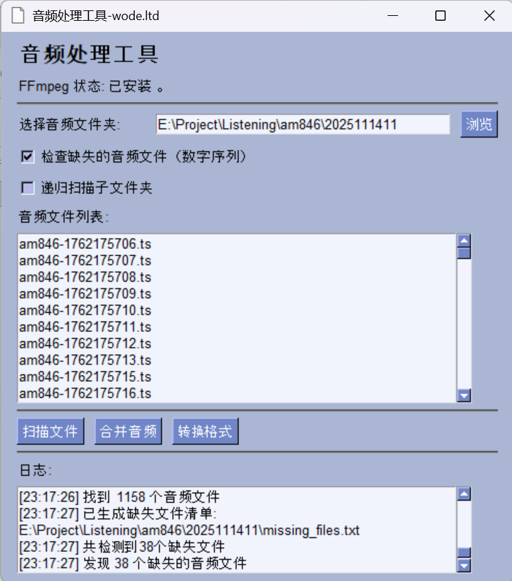
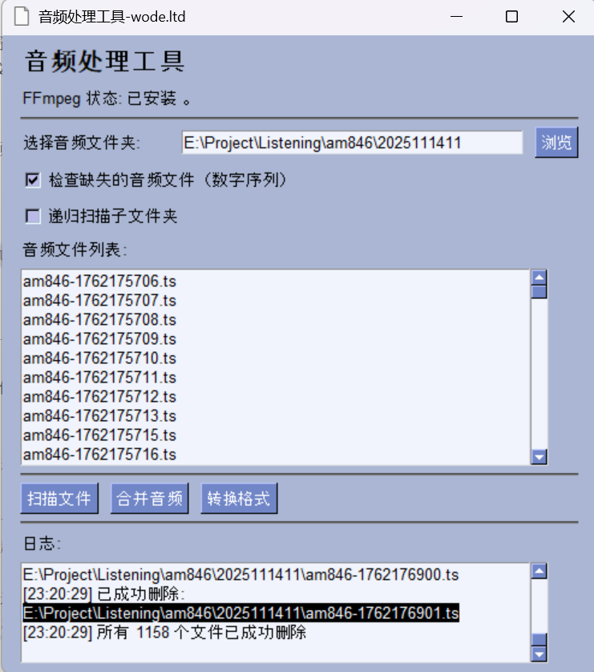
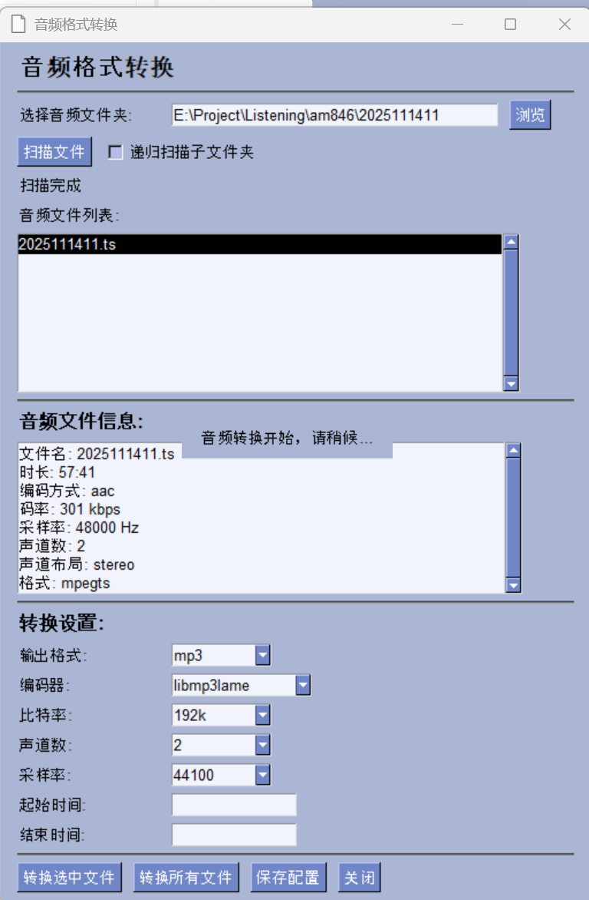
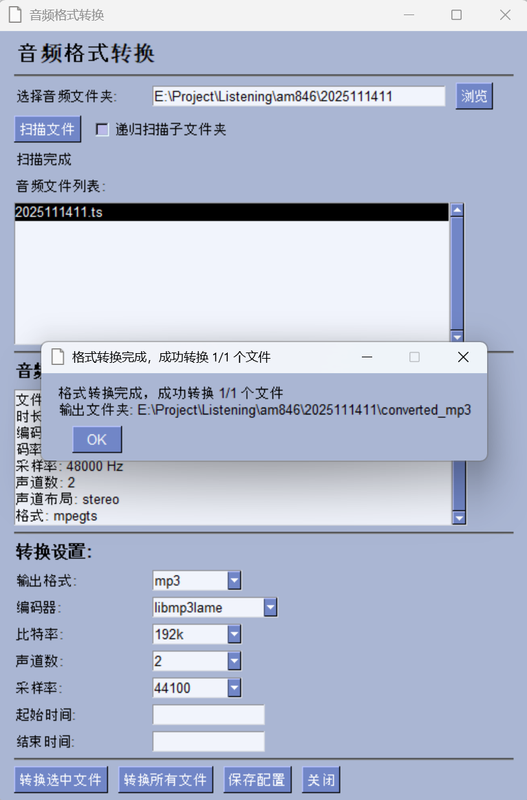

# 音频处理工具

<div align="center">
  
  <p>一款功能强大、界面友好的音频处理软件</p>
</div>

一款基于Python PySimpleGUI开发的音频处理软件，提供音频文件扫描、缺失文件检查、音频合并和格式转换等全面功能。

## 功能特点

✅ **FFmpeg检测**：软件启动时自动检测并显示本机FFmpeg的安装状态和版本信息
✅ **文件夹扫描**：支持递归扫描文件夹中的音频文件，可自定义扫描深度和文件数量限制
✅ **缺失文件检查**：智能检查音频文件名数字序列的完整性，生成缺失文件清单
✅ **音频合并**：高效合并多个音频文件为一个，支持无损合并和删除原始文件选项
✅ **格式转换**：强大的音频格式转换功能，支持多种格式之间的互相转换
✅ **高级转换参数**：可自定义编码器、比特率、声道数、采样率等详细参数
✅ **硬件加速支持**：自动检测并使用可用的GPU硬件加速，提升转换速度
✅ **进度显示**：直观的转换进度条，实时显示处理状态
✅ **配置自动保存**：记住用户偏好设置，提升使用体验
✅ **完善的错误处理**：遇到问题时提供详细的错误信息和解决方案提示

## 安装要求

- **Python环境**：Python 3.6或更高版本
- **FFmpeg**：必须安装FFmpeg并添加到系统环境变量中
- **Python库**：PySimpleGUI

## 快速开始

### 方法1：使用预编译的可执行文件（推荐）

1. 下载`dist`文件夹中的`audio_processor.exe`文件
2. 确保已安装FFmpeg并添加到系统环境变量
3. 双击`audio_processor.exe`直接运行

### 方法2：从源代码运行

```bash
# 克隆或下载代码后
cd AudioProcessor

# 安装依赖
pip install -r requirements.txt

# 运行程序
python audio_processor.py
# 或使用批处理脚本
start.bat
```

## 安装步骤

### 1. 安装FFmpeg

- **Windows**：
  1. 从 [FFmpeg官网](https://ffmpeg.org/download.html) 下载Windows版本
  2. 解压到本地目录（如 `C:\ffmpeg`）
  3. 将 `C:\ffmpeg\bin` 添加到系统环境变量Path中
  4. 打开命令提示符，输入 `ffmpeg -version` 验证安装是否成功

- **macOS**：
  使用Homebrew安装：`brew install ffmpeg`

- **Linux**：
  Ubuntu/Debian: `sudo apt-get install ffmpeg`
  CentOS/RHEL: `sudo yum install ffmpeg`

### 2. 安装Python库

打开命令提示符，执行以下命令安装PySimpleGUI：

```
pip install pysimplegui
```

## 使用指南

### 1. 基本操作流程

1. **启动软件**：
   - 双击 `audio_processor.exe` 或 `start.bat`

2. **选择并扫描文件夹**：
   - 点击"浏览"按钮选择音频文件所在文件夹
   - 可选：勾选"递归扫描"深入搜索子文件夹
   - 点击"扫描文件"开始分析音频文件


3. **检查缺失文件**（可选）：
   - 扫描后，软件会自动检查文件序列完整性
   - 缺失的文件信息会显示在缺失文件列表中

4. **合并音频文件**：
   - 确保文件列表中的文件按正确顺序排列
   - 点击"合并音频"按钮
   - 选择是否删除原始文件
   - 等待合并完成

### 2. 格式转换详解

1. **打开转换页面**：点击主界面上的"转换格式"按钮

2. **选择并扫描文件**：同基本操作

3. **配置转换参数**：
   - **输出格式**：选择目标音频格式（MP3、WAV、FLAC等）
   - **编码器**：为每种格式选择合适的编码器
   - **比特率**：设置音频质量（越高音质越好但文件越大）
   - **声道**：选择立体声或单声道
   - **采样率**：设置音频采样频率
   - **时间裁剪**：可选地裁剪音频的开始和结束时间

4. **执行转换**：
   - 选择要转换的文件（单选或全选）
   - 点击"转换选中文件"或"转换所有文件"
   - 监控转换进度
   - 转换后的文件保存在 `converted_<格式>` 子文件夹中



## 支持的音频格式

- **MP3**: 最常用的有损压缩格式，适合一般用途
- **WAV**: 无损音频格式，保留原始音质
- **FLAC**: 无损压缩格式，音质好且文件较小
- **AAC**: 高质量有损压缩格式，常用于移动设备
- **OGG**: 开源的有损压缩格式，音质优于同等大小的MP3
- **WMA**: Windows媒体音频格式
- **M4A**: 基于AAC的格式，常用于苹果设备
- **TS**: 传输流格式，常用于流媒体

## 注意事项

- 确保已正确安装并配置FFmpeg，这是软件运行的必要条件
- 音频合并时，软件会尝试按数字顺序排序文件名，请确保文件名格式一致
- 大文件转换可能需要较长时间，请保持程序窗口开启
- 软件在同目录下创建 `config.json` 文件保存用户配置，请勿手动删除
- 建议在处理大量文件时使用分批处理，以获得最佳性能

## 许可证

[MIT License](LICENSE)

## 贡献

欢迎提交Issue和Pull Request来帮助改进这个项目！

## 致谢

- [FFmpeg](https://ffmpeg.org/) - 强大的多媒体处理工具
- [PySimpleGUI](https://www.pysimplegui.org/) - 简单易用的GUI库
- 所有贡献者和用户

## 常见问题

### Q: 为什么启动时提示找不到FFmpeg？
A: 请检查FFmpeg是否已正确安装并添加到系统环境变量中。可以在命令提示符中输入 `ffmpeg -version` 验证。

### Q: 音频合并后音质下降怎么办？
A: 软件使用 `-c copy` 参数进行无损合并，但只适用于相同编码格式的文件。如果文件格式不同，FFmpeg会自动重新编码。

### Q: 转换格式时出现错误怎么办？
A: 请检查原始音频文件是否损坏，或尝试使用不同的目标格式。
